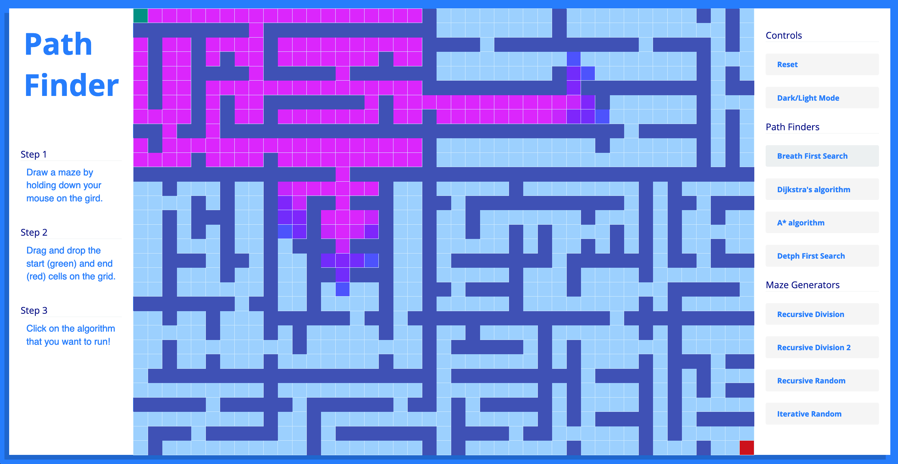

# Path Finder
# 

## What is Path Finder?
Path Finder is a web app that shows how a path can be found from two points in a 2d space. The algorithm start from the green node and is looking for the red node. Path Finder is also a good tool to understand how we can create mazes by generating walls using different paterns. 

### Path Finding Algorithms:
* Breath First Search
* Depth First Search
* A \*
* Dijkstra

### Maze Generation Algorithms:
* Recursive division
* Recursive random
* Iterative random

## Built with
NodeJS, Build-React-App, React, Fun!

## Demo
Here is a working live demo :  https://jbmerville.github.io/Path-Finder/
